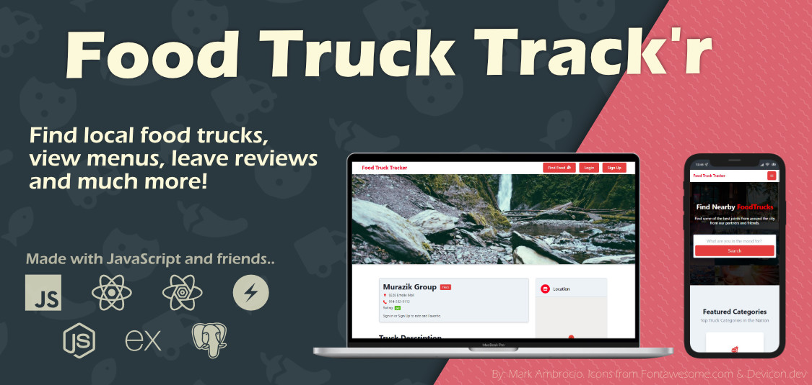

[](https://food-truck-tracker.markambrocio.com/)

# Fullstack Foodtruck Trackr

## About and tools used.

A portfolio remake of a past project. I primarily remodeled the frontend. It is styled with Chakra-UI, using React-Query for cache and state managment. I also updated the backend to support Geo-Locations for Trucks.

## Find Me

### Twitter: [@\_mark_ambro](https://twitter.com/_mark_ambro)

### **Description**

FoodTruck TrackR was designed to make finding and eating at a food truck fast, easy and fun. Quickly see all of our Operator partners' nearby food trucks, view their current real-time GPS location, know the scheduled arrival and departure times and much more, all in our easy to use app. Try FoodTruck TrackR today, and enjoy the best food YOUR city has to offer.

### **MVP**

1. `User` can create an account as either a `operator` or `diner` by providing at minimum a unique `username`, a valid `email` and a `password`.

2. `User` can log in as an `operator` or `diner` using the `username` and `password` provided on sign-up / account creation.

3. An authenticated `operator` can create, view, update and delete a `truck` object.
   1. A `truck` will have a `menu` comprised of `menuItems`.
   2. A `truck` will have a `currentLocation`.
4. An authenticated `user` can `favorite` and `rate` trucks.
   1. View `trucks` nearest to them.

## .ENV variables needed to run

```js
// front end
REACT_APP_HOSTED_BACKEND=
REACT_APP_GOOGLE_MAPS_KEY=

// backend
LOCAL_DB_PASS=
SECRET_JWT=

```

## _References_

### Original Team Front-end Repo I helped with.

[Food Truck Trackr Front End](https://github.com/foodtrucktrackr-bw/foodtrucktrackr-frontend)

Icons used in image came from [Fontawesome](https://fontawesome.com/license) and [DevIcon](https://devicon.dev/)

Description / MVP / Stretch - text from [@lambaschool](https://github.com/LambdaSchool)
